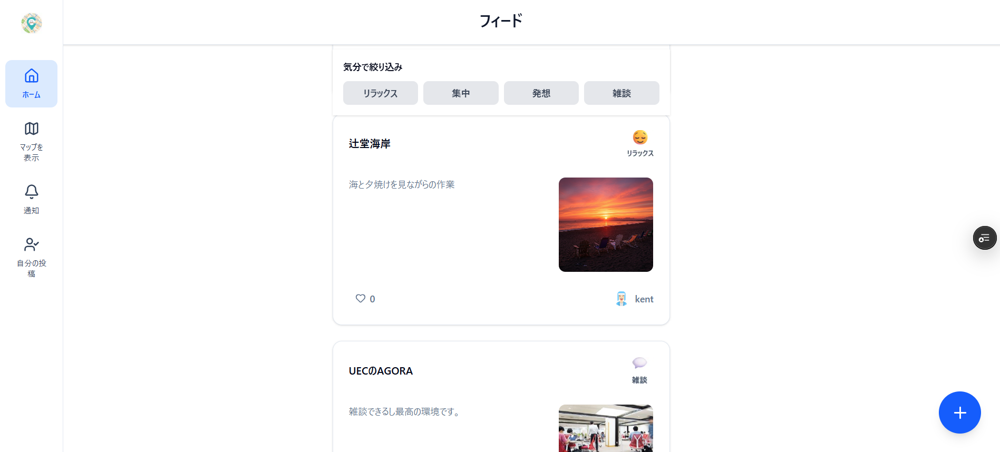

# SerenSpot - 作業スポットをシェアしよう。

## 製品概要

### 背景(製品開発のきっかけ、課題等）

近年、場所に縛られずに働く「ノマド」という働き方が注目されています。
実際に、フリーランスや学生など、環境を変えて作業することを好む人は多く存在します。
しかし、「いつも同じカフェで飽きた」「新しい場所を探したいが雰囲気が分からない」といった悩みを抱える人も少なくありません。  
また、気分転換をしたいときに「どこに行けばいいか分からない」という課題もあります。
そこで、**そのときの気分によって選べる新たな作業場所発見体験**を提供するアプリを開発しました。

### 製品説明（具体的な製品の説明）

「SerenSpot」は、ユーザーのレビューをもとに**新しい作業場所を発見できる**アプリです。  
Google マップのように“場所”を中心に表示するのではなく、**「レビュー単位」でスポットが見える**点が特徴です。  
たとえば、「〇〇カフェは静かで集中できる」「公園のベンチで新しいアイデアが浮かんだ」といった実体験の投稿から、 ユーザーは思いがけない作業スポットを直感的に見つけることができます。
なお「SerenSpot」の由来は Serendipity + Spot です。

### 特長

#### 1. 「ひとこと」単位での場所発見

地図上に表示されるのは場所ではなく「ひとこと」。他人のリアルな体験をもとに直感的な場所選びが可能です。

#### 2. 気分転換を促す多様な提案

カフェだけでなく、海辺や公園など「発想が広がる空間」も提案対象。ユーザーの作業スタイルや気分に合わせたスポットを提案します。

### 解決出来ること

- 新しい作業場所を探す手間を削減
- 気分転換先を手軽に発見
- 新しい場所に行く不安や心理的ハードルを軽減

### 今後の展望

- 投稿者と訪問者がゆるくつながることができるフィードバック機能（「あなたの投稿を見た人が〇〇に訪問しました」通知）
- AI によるユーザー嗜好に基づいたスポット提案機能

### 注力したこと（こだわり等）

<!-- - レビューを「体験の記録」として活かし、感情や雰囲気まで伝わるデザインにした。 -->
<!-- - 一人でも安心して利用できる、温かみのある UI 設計を重視。 -->

---

## 開発技術

### 活用した技術

#### API・データ

- Google Maps API（位置情報取得、ナビゲーション）

#### フレームワーク・ライブラリ・モジュール

- フロントエンド: Next.js, TypeScript, Tailwind CSS, shadcn/ui
- データベース: CockroachDB
- デプロイ: Vercel
- ORM：Prisma

#### デバイス

- Web (Google Chrome, Firefox, Microsoft Edge)

---

### 独自技術

#### ハッカソンで開発した独自機能・技術

- 独自で開発したものの内容をこちらに記載してください
- 特に力を入れた部分をファイルリンク、または commit_id を記載してください。

---
