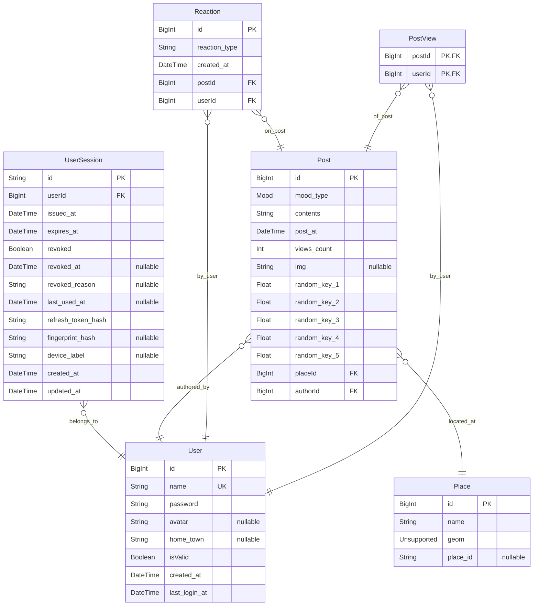

# SerenSpot - 新たな作業スポットとの出会いを。

https://github.com/user-attachments/assets/424f172a-eda7-494f-8156-121ea1fa6bf6

## 製品概要

### 背景(製品開発のきっかけ、課題等）

近年、場所に縛られずに働く「ノマド」という働き方が注目されています。
フリーランスや学生など、環境を変えて作業することを好む人は多くいます。  
しかし、「いつも同じカフェで飽きた」「新しい場所を探したいが雰囲気が分からない」といった悩みを抱える人も少なくありません。
また、気分転換をしたいときに「どこに行けばいいか分からない」という課題もあります。  
そこで、そのときの気分で選べる**新しい作業場所との出会い**を提供するアプリを開発しました。

### 製品説明（具体的な製品の説明）

「SerenSpot」は、ユーザーのレビューをもとに**新しい作業場所を発見できる**アプリです。  
Google マップのように「場所」そのものを中心に表示するのではなく、**「レビュー単位」でスポットを可視化する**点が特徴です。たとえば、「個人経営の〇〇カフェは静かで集中できる」「公園のベンチで新しいアイデアが浮かんだ」「多摩川の河川敷は意外と開発作業に適している」といった実体験の投稿から、ユーザーは**思いがけない作業スポット**を直感的に見つけられます。  
なお「SerenSpot」の由来は Serendipity + Spot です。

このサービスで、**いつものカフェや変わり映えのないコワーキングスペースから一歩踏み出し、気分転換はもちろん、集中力や発想力を高める「新しいお気に入りの作業場所」を見つけましょう。**

<h3>ペルソナ</h3>

#### プロフィール

名前：松永藍

年齢：27歳

職業：フリーランスデザイナー

居住地：東京都・中目黒

利用デバイス：Macbook Pro/iPhone

主な活動場所：カフェ・コワーキングスペース

#### 背景

- 場所を変えることで気分を変えて作業に集中したいが、どうしても同じような場所になりがちで飽き飽きしている。
- 新しい場所を開拓したいが、実際に行かないと作業のしやすさなどが判断できないのが面倒。
- SNSやGoogleマップは情報が多すぎて、自分の作業スタイルに合った場所を見つけづらいと感じている。
- 基本的に一人で作業しているため、他のノマドワーカーとのつながりを欲している。が、ダイレクトなつながりより”ゆるいつながり”がいい。
- 偶発的な出会いで日常を変えたい。

## 行動パターン

1. 朝カフェで作業→昼過ぎに集中が切れる。
2.  気分転換をしたくて別の場所を探すが、時間をかけたくない。
3. 「SerenSpot」でレビューを眺めながら、自分の“作業モード”に合いそうな場所を見つける。
4. 実際に行って作業し、「静かで集中できた」など簡単なレビューor「作業のしやすさ」「混雑度」など定型情報を投稿。
5. 後日、自分の投稿した場所に誰かが行ったという通知が届き、ちょっと嬉しい。また投稿しようと思う。

#### ニーズ・課題

| ニーズ | 背景課題 |
| --- | --- |
| 気分転換できる場 | 同じカフェだと刺激がなく集中できない |
| 失敗のない場所選びをしたい | 行ってみたら混雑・騒音などで作業できないことがある |
| 他の人のリアルな体験を知りたい | 星評価よりも、どんな雰囲気だったかを重視している |
| さりげない繋がりを感じたい | 一人作業が多く孤独を感じやすい |

### 特長

#### 1. 「ひとこと」単位での場所発見

ユーザーがまず目にするのはマップではなく「ひとこと」レビュー。他のユーザーのリアルな体験をもとに、直感的な場所選びが可能です。

#### 2. 気分転換を促す多様な提案

カフェだけでなく、海辺や公園など「意外な場所」も提案対象。ユーザーの作業スタイルや気分に合わせたスポットを提案します。

### 解決出来ること

- 新しい作業場所を探す手間を削減
- 気分転換先を手軽に発見
- 新しい場所に行く不安や心理的ハードルを軽減

### 今後の展望

- こだわり検索（コンセントの有無、混雑度、テーブルの有無など）
- 投稿者と訪問者がゆるくつながることができるフィードバック機能（「あなたの投稿を見た人が〇〇に訪問しました」通知）
- AI によるユーザー嗜好に基づいたスポット提案機能
- ノマドワーカーに向けた AI チャットによるワーケーションプランニング機能

### 注力したこと（こだわり等）

- ユーザーが新しい場所へ“偶然”出会えるよう、メイン画面にはマップベースではなく SNS ライクなフィードベースの UI を採用しました。

- そのときの気分に応じて絞り込めるフィルター機能を用意し、利用シーン（リラックス・集中・発想・雑談）に合った場所を見つけやすくしました。

- 「ここだ！」と思えるスポットが見つかった際にすぐナビゲーションできるよう、スポット投稿の経路ボタンからワンタップで Google マップのルート検索へ飛べる導線を設けました。

多くのユーザーが使えば使うほど新しい場所との偶発的な遭遇ができるようになりますので、楽しんで使っていただけると幸いです。

---

## 開発技術

### 活用した技術

#### API・データ

- Google Maps API（位置情報取得、ナビゲーション）

#### フレームワーク・ライブラリ・モジュール

- フロントエンド: Next.js, TypeScript, Tailwind CSS, shadcn/ui
- データベース: CockroachDB
- デプロイ: Vercel
- ORM：Prisma

#### デバイス

- Web (Google Chrome, Firefox, Microsoft Edge)

---

### 独自技術

#### ハッカソンで開発した独自機能・技術

- ランダムキーを用いたフィード表示の工夫（[/src/lib/feed-types.ts](https://github.com/jphacks/tk_b_2509/blob/a37ac37aac03601034520a029b9ed028738674ae/src/lib/feed-types.ts#L2-L8), [/src/app/search/page.tsx](https://github.com/jphacks/tk_b_2509/blob/a37ac37aac03601034520a029b9ed028738674ae/src/app/search/page.tsx#L18-L26)）  
  投稿ごとに複数のランダム値を事前計算・保持し、毎回異なるキーでソートして投稿一覧を取得することで、効率的に順番をシャッフルしたフィード表示を実現しました。これによりユーザーはアクセスのたびに新鮮な投稿に出会え、偶発的な発見を促します。

- レビュー内容付きマップピン表示（[/src/components/Map/GoogleMap.tsx](https://github.com/jphacks/tk_b_2509/blob/a37ac37aac03601034520a029b9ed028738674ae/src/components/Map/GoogleMap.tsx#L44-L52), [/src/app/search/page.tsx](https://github.com/jphacks/tk_b_2509/blob/a37ac37aac03601034520a029b9ed028738674ae/src/app/search/page.tsx#L34-L41)）  
  Google Maps API を活用し、地図上のピンにスポット名と短文レビューを吹き出し表示する独自 UI を実装しました。ユーザーはフィードに加え、地図上でも直感的にスポットの雰囲気をつかむことができます。投稿データをマップピン（座標と内容）に変換して表示することで、場所探しとレビュー閲覧をシームレスに統合しています。

---

### 注意事項

レンダリングの都合上、ログイン後のフィード表示に時間がかかる場合があります。その際は一度「気分で絞り込み」ボタンをクリックして強制的にレンダリングを実行してください。
